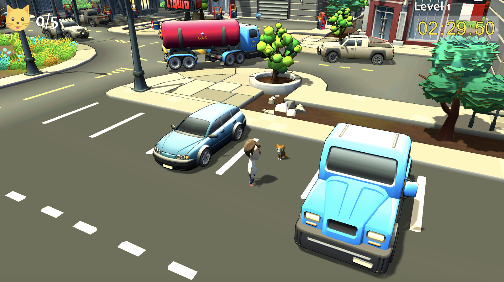

# Cat Seekers
It's a hidden object game developed by [Madylune](https://github.com/Madylune).
This game is developed with [Unity](https://unity.com/fr).

  

## Rules
You are a volunteer in an association for the rescue of abandoned cats. Your mission is to find these cats in the city. 
You have to complete the level's goal within a limited time.

## Controls
- Zoom [mouse wheel]
- Camera rotation [hold left click]
- Move up [ W ] or [ ⇧]
- Move down [ S ] or [ ⇩]
- Move left [ A ] or [ ⇦]
- Move right [ D ] or [ ⇨]
- Jump [ SPACE ]

## Releases
### V1.0
- Player movement (run and jump)
- Handle camera zoom with mouse wheel
- Orient the camera horizontally while holding the right click
- Level change after a goal achievement
- Automatic generation of cats on the map at each level according to their specified position
- Play music background and sound when catching cat
- Calc score according to number of found cat
- Display a countdown with color variation
- Stop game if the time is over
- Possibility to replay the same level in case of failure
- Screens: Main menu, game, credits, pause menu, victory, game over

## Credits
### Game design, level design, programmation
- [Madylune](https://github.com/Madylune)
### Assets from:
- [Ladymito](https://assetstore.unity.com/publishers/6371)
- [Supercyan](https://assetstore.unity.com/publishers/22143)
- [SICS Games](https://assetstore.unity.com/publishers/18116)
- [HONETi](https://assetstore.unity.com/publishers/5245)
### Musics and sounds from:
- [AntumDeluge](https://opengameart.org/users/antumdeluge)
- [Dan Knoflicek](https://opengameart.org/users/macro)